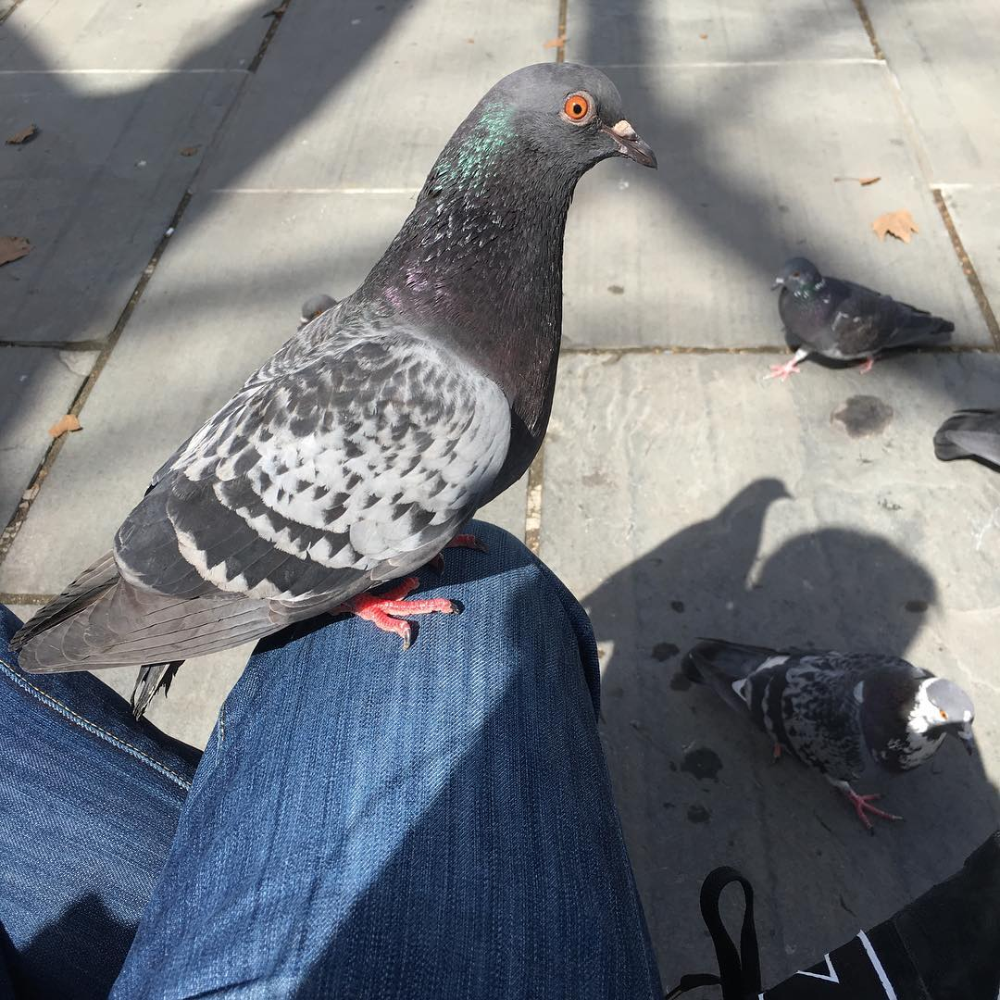

Hello and welcome to the new (and hopefully final) resting place of my blog. After going through many transitions with the site over the last four years, I believe it is safe to say that I now know the direction I would like to take it in. And that direction, simply put--birds. I'm kidding. There will be a bit of everything. Stay tuned.

In the meantime, here is a picture of a cute pigeon begging for my bread in City Hall Park the other day.

I hope you enjoyed because there are many more to come!
